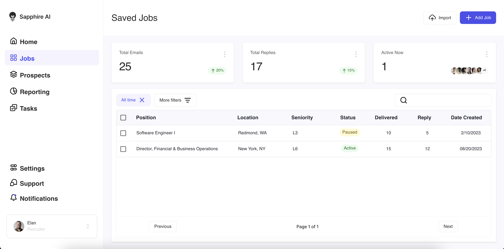
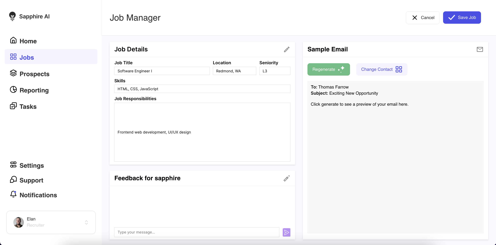
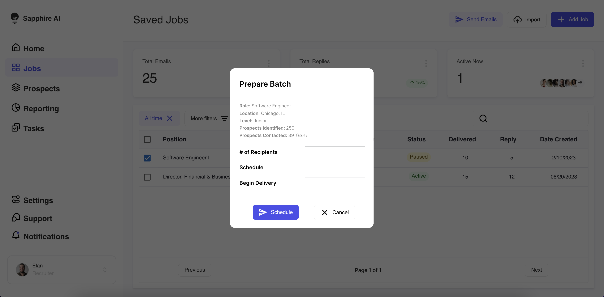
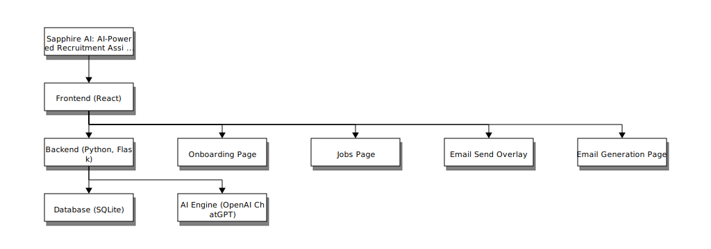

# Sapphire AI: AI-Powered Recruitment Assistant

## Overview

Sapphire AI is a tool designed to automate the recruitment process by utilizing artificial intelligence. It focuses on generating personalized emails and managing recruitment data, aiming to simplify the outreach process to potential candidates.

### Important Notes

For me this project served as an opportunity for me to improve my front-end software engineering skills, leading to a product with a polished and user-friendly interface. Consequently, the back-end development, while functional, is less comprehensive, reflecting the focus on the aesthetic and interactive aspects of the application. Similarly, there are many placeholder elements of the UI.

A secondary goal of this project was to explore the Open AI API and potential for sales and marketing technology.

**Again, this isn't in a super polished state, as I only spent about 8 hours building this.**

---

**Note on Deployment:**
This project was not initially intended for deployment, and as such, there are a few unresolved issues specific to its hosted version on AWS:

1. **Icon Loading Issue**: Some icons may not load correctly.
2. **Job Editing Limitation**: While new jobs can be created, editing existing jobs is currently not possible.
3. **OpenAI Features**: The online version does not enable OpenAI features, and appropriate error messages explaining this limitation have not been added yet.

---

## Table of Contents

1. [Background](#background)
3. [User Interface](#user-interface)
4. [Capabilities](#capabilities)
5. [Technical Architecture](#technical-architecture)
6. [Setup Guide](#setup-guide)


## Background

Recruitment is a critical yet often cumbersome process for many organizations. Traditional methods involve significant manual effort in reaching out to potential candidates, particularly in personalizing communication. Sapphire AI addresses this challenge by automating the creation and distribution of personalized job outreach emails, thereby streamlining the recruitment workflow.


## User Interface

### 1. Onboarding Page
<p align="center">
  
</p>

### 2. Jobs Page
<p align="center">
  
</p>

### 3. Email Generation Page
<p align="center">
  
</p>

### 4. Email Send Overlay
<p align="center">
  
</p>

## Capabilities

It's crucial to recognize that some user interface elements are conceptual placeholders, showcasing potential features. The actual functionalities available in this demo include:
<p align="center">
  
</p>

### Onboarding

- **User Input Form**: Users can input details about their business and recruitment needs. This information is crucial for tailoring the user experience and is stored for future reference.
- **Data Storage**: The information provided during onboarding is securely saved, ensuring its availability for subsequent processes like email generation.

### Jobs Page

- **Job Listings Display**: This feature presents the saved job listings in an organized, tabular format, allowing for easy viewing and management.
- **Navigation to Email Generation**: Users can navigate to the email generation page for a specific job by clicking on a job listing.
- **Addition of New Job Listings**: A dedicated feature for adding new job listings, enhancing the dynamic nature of job management.

### Email Operations

- **Selection and Sending of Emails**: This functionality enables the selection of specific jobs for which emails need to be sent, streamlining the email sending process.
- **Send Email Overlay**: A specialized overlay that allows users to specify the number of email recipients, adding a layer of customization to the email sending process.
- **Email Generation and Data Storage**: The system is capable of generating emails based on the selected jobs and storing them efficiently for future reference.

### Email Generation Page

- **Job Details Panel**: This panel is designed for inputting and editing details specific to each job, ensuring that the emails generated are accurate and relevant.
- **AI Feedback Mechanism**: Users can provide feedback on the AI-generated emails, which is crucial for the continuous improvement of the AI system.
- **Preview and Regeneration of Emails**: Users are offered a preview of the email content with the option to regenerate it, ensuring satisfaction with the final output.


## Technical Architecture
<p align="center">
    
</p>

### Front-End

- **JavaScript with React**: The front-end is built using JavaScript and React, focusing on a responsive and intuitive interface.

### Back-End

- **Python with Flask**: The back-end is developed using Python and Flask, ensuring effective data handling and server operations.

### Database

- **SQLite**: Used for storing email content and user inputs, facilitating data management and retrieval.

### AI Engine

- **OpenAI ChatGPT**: Integrated for intelligent and personalized email content generation.

### Hosting

- **AWS Amplify**: Open AI capabilites are disabled.

# Setup Guide

## Pre-requisites

- Python3
- node v18.18.0 (npm v10.1.0)

---

## Backend Setup

### Step 1: Create a Python Virtual Environment
Navigate to the project directory and execute the following command to create a Python virtual environment:
```bash
python3 -m venv myenv
```
### Step 2: Activate the Virtual Environment
On macOS and Linux:
```bash
source myenv/bin/activate
```
On Windows:
```bash
.\myenv\Scripts\activate
```
### Step 3: Install Python Dependencies
```bash
pip install  openai Flask Flask-CORS sqlite3
```
## Frontend Setup

### Step 4: Install Node Dependencies
In the root directory of the project, run:
```bash
npm install
```

## Running the App
### Step 5: Start the Backend
Navigate to the src directory and run:
```bash
cd src
python app.py
```
### Step 6: Start the Frontend
Open another terminal window, navigate to the src folder in the project directory and run:
```bash
npm run dev
```
The React app should now be up and running.


